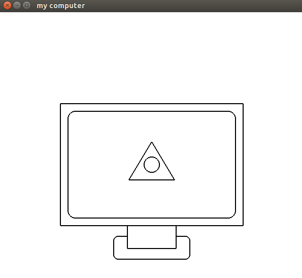
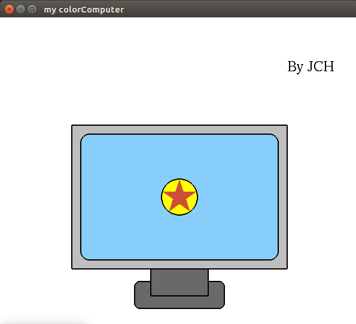
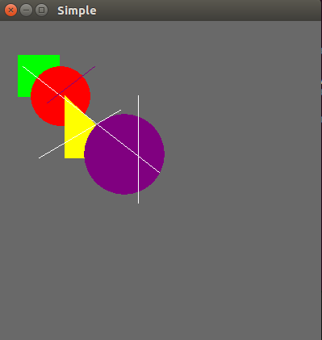
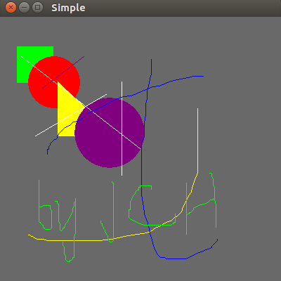
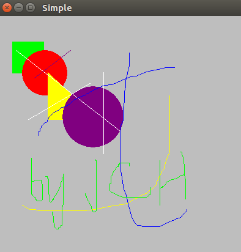

# Exam1 说明文档
姓名：贾城昊
学号：2021K8009929010
## 1.代码明细
本次实验包括三部分内容，分别对应三个子文件夹，每个子文件夹里分别有一个源文件``main.cpp``和一个可执行文件``main`` 。同时设置了一个通用的可执行脚本与子文件夹平行，具体使用方法见第三部分编译运行说明

各个实验的设计细节详见第四部分，文件夹结构如下：
```
.
├── compile.sh              #可执行脚本，用于编译各个子文件夹下的源文件
├── execute.sh              #可执行脚本，用于编译各个子文件夹下的源文件并执行
├── hw1_computer            #实验1：基本图形绘制
│   ├── main                #可执行文件
│   └── main.cpp            #实验1源文件
├── hw2_colorComputer       #实验2：平面多边形区域填充
│   ├── main                #可执行文件
│   └── main.cpp            #实验2源文件
├── hw3_InteractiveDraw     #实验3：交互控制绘制
│   ├── main                #可执行文件
│   └── main.cpp            #实验3源文件
├── img                     #运行效果截图，用于编写Readme.md
│   ├── image1.png
│   ├── image2.png
│   ├── image3.png
│   ├── image4.png
│   └── image5.png
├── Readme.md               #实验说明文档
└── Readme.pdf              #实验说明文档PDF版

```

## 2.环境配置
无额外安装包，本地使用MobaXterm连接服务器，也通过本地Linux虚拟机进行运行

## 3.程序编译与运行命令
### 3.1 编译指令
三个子文件夹的源文件编译通用一个可执行脚本``compile.sh`` ，只需在编译的时候指定编译的子文件夹序号，例如``./compile.sh 1`` ，即可编译hw1_computer文件夹下的源文件，编译完成后在hw1_computer文件夹下生成可执行文件main，执行``./main``即可运行程序

compile.sh脚本内容如下：
```
cd *$1* && \
g++ main.cpp -lglut -lGLU -lGL -o main && \
cd .. && \
echo "Compile exp$1 finsihed!"
```
若希望直接通过指令进行编译，只需要在对应子文件夹下输入 ``g++ main.cpp -lglut -lGLU -lGL -o main``即可

### 3.2 编译+运行指令
同时本人还写了一个通用的可执行脚本``execute.sh`` ，用于编译各个子文件夹下的源文件，并运行可执行文件。例如输入``./execute.sh 1`` ，即可编译hw1_computer文件夹下的源文件，并执行编译好的可执行文件。
execute.sh脚本内容如下：
```
cd *$1* && \
g++ main.cpp -lglut -lGLU -lGL -o main && \
echo "Compile exp$1 finsihed!"
echo "Loading window for exp$1..."
./main
```

## 4.实验设计与效果
### 4.1 基本图形绘制
#### (1)设计思路
绘画函数参考了课程ppt，但做了如下改动:
- 使用相对坐标系，即相对屏幕中心作偏移，左边取值范围为``-1~1`` ，所以将参数类型由``int``改为``double``类型。
- 实现``glRectSmooth()``函数，用于绘制圆角矩形，所需参数为：矩形的最小包围盒大小、圆角部分的圆半径、绘制的模式(可选·``GL_LINE_LOOP``和``GL_POLYGON`` ) 。
- 单独实现一个``glArcPoint()``函数，只定义弧上散点，而不将其连接，方便其它函数调用，例如使用``glRectSmooth()``绘画圆角矩形。相应地，``glArc()``也只需调用即可。
  
此外还需说明的是电脑基座的绘制方式，为支架实现“遮挡”底座的效果，一种思路是绘制底座时严格不穿过支架，但此种方式较为麻烦，未能很好地利用封装的函数;另一种较为简便的实现方式如下：
- 绘制一个圆角矩形当作底座；
- "擦除"圆角矩形穿过支架的部分(使用白色线段覆盖) ;
- 绘制一个普通矩形当支架
  
注意2、3两步不可颠倒，否则支架与底座交界处会有一个白点。
#### (2)实验效果
运行结果如下：


### 4.2 平面多边形区域填充
#### (1)设计思路
在实验2的基础上做颜色填充，同时对电脑里面的图案进行了修改，新增了``glStar()``函数，用于画N角星(N为奇数)；并且新增了``glString()``函数，用于展示字符串，用于个人署名。

为使得代码阅读更友好，把所有使用到的颜色定义成宏，如下：
```
#define BLACK 0，0，0
#define WHITE 1，1，1
#define GREY    190.0/255， 190.0/255， 190.0/255
#define DIMGREY 105.0/255， 105.0/255， 105.0/255
#define YELLOW  255.0/255， 255.0/255， 0.0/255
#define RED     205.0/255， 79.0/255，  57.0/255
#define BLUE    135.0/255， 206.0/255， 250.0/255
```
实验2描绘边框时使用的模式是``GL_LINE_LOOP`` ，而填色时需要将之修改为``GL_POLYGON`` 。本次实验总体采取先填色后描边的策略。

新增的``glstar()``用于画N角星，其绘画模式是``GL_TRIANGLE_FAN`` ，本质是画三角形带，传入参数分别为中心坐标，角的个数，绘画模式，代码如下：
```
void glStar(double cx， double cy， double radius， int numSides， int mode){
  double angleStep = 2.0 * PI / numSides;
  double offsetAngle = PI / 2.0;

  glBegin(mode);
  glVertex2f(cx， cy);
  for(int i = 0; i <= numSides; i++){
    double angle = offsetAngle + ((i * 2) % numSides) * angleStep;
    double x = cx + radius * cos(angle);
    double y = cy + radius * sin(angle);
    glVertex2f(x， y);
  }

  glEnd();
}
```
新增的``glString()``用于展示字符串，主要调用OpenGL的``glutBitmapCharacter()``函数，颜色设置为黑色，代码如下：
```
void glString(const char* str， double x， double y){
  glColor3f(0.0， 0.0， 0.0);
  glRasterPos2f(x， y);//字符串位置
  
  for(int i = 0;i < strlen(str); i++){
    glutBitmapCharacter(GLUT_BITMAP_TIMES_ROMAN_24 ， str[i]);
  }

  glutSwapBuffers();
}
```

#### (2)实验结果
运行结果如下：


### 4.3 交互控制绘制
#### (1)设计思路
本次实验的交互控制绘制，实现了以下功能：
- 选择背景颜色
- 选择画笔颜色
- 选择绘画图形
- 选择绘画模式
- 清空画面
- 退出程序
  
其中绘画图形支持线段，三角形，矩形和圆形；
绘画模式分为基本绘画模式（Basic Draw Mode）和自由绘画模式（Free Draw Mode）以及退出绘画模式（Close Draw Mode）
- 基本绘画模式指的是在绘画图形中选择一种进行绘画，默认为直线；
- 自由绘画模式指的是绘画出鼠标左击后到松开前的移动路径；
- 退出绘画模式指的是不对画面进行绘画。
  
清空画面则是保持背景颜色不变，对已经绘画的图形清空

代码在PPT的基础上进行增添与修改，增加的函数主要有以下几处：
- 添加了 ``bg_color_menu()``函数用于选择背景颜色
- 添加了``motion()``函数用于自由绘画模式下监听鼠标移动
- 添加了实验2中的``glArc()``函数用于支持绘画圆形

同时为了支持自由绘画的功能，添加了一个数组``b``用于记录鼠标左击到松开前移动路径上的点（通过``motion()``函数储存），而在原有存储起止位置的数组``a``中改为存储新添加的数组``b``的起始和终止的索引：
```
else if(mod == -1){
    if ((num <= N) && (state== GLUT_DOWN) && (button== GLUT_LEFT_BUTTON)){
        a[num * 6] = my_index;  //起始索引
        a[num*6+1] = 0;      //是否结束，用于判断结束索引
        b[my_index++] = x;
        b[my_index++] = (400 -y);
        isDrawing = true;
    }
    
    if((num<=N) && (state==GLUT_UP) && (button==GLUT_LEFT_BUTTON) && (x!=a[num*6]|| y!=a[num*6+1])){
        a[num*6+1] = 1;     //是否结束，用于判断结束索引
        a[num*6+2] = my_index; //结束索引
        a[num*6+4] = color; //颜色
        a[num*6+5] = 5;     //5代表自由绘画模式
        printf("num:%d\n"， num+1);
        num++;
        isDrawing = false;
        display();
    }
}
```

而自由绘画模式的绘画的代码如下：
```
start_idx = a[i*6];
end_idx = a[i*6+1] ? a[i*6+2] : my_index;
glBegin(GL_LINE_STRIP);
for(int j = start_idx; j < end_idx; j+=2){
    glVertex2f(b[j]， b[j+1]);
}
glEnd();
```

切换背景操作则是根据用户在菜单中的选项来设置OpenGL的背景颜色，并请求重新绘制窗口即可，代码如下：
```
void bg_color_menu(int value){
    switch(value)
    {
    case 1 :
        glClearColor(BLACK, 1.0);
        break;
    case 2 :
        glClearColor(GREY, 1.0);
        break;
    case 3 :
        glClearColor(DIMGREY, 1.0);
        break;
    default:
        glClearColor(BLACK, 1.0);
        break;
    }

    glutPostRedisplay();
}
```

#### (2)实验效果
代码运行效果如下：
基本绘制模式效果：

自由绘制模式效果：

切换背景颜色效果:
