# Exam2 说明文档

<center>
    2021K8009929010 贾城昊
</center>

[TOC]

## 1.代码明细

实验的具体实现与效果详见第4部分与第5部分。

```
.
├── bunny.obj               # 实验使用的待渲染的三维模型文件
├── compile.sh              # 用于编译的可执行脚本
├── img                     #运行效果截图等，用于编写Readme.md
│   ├── image10.png
│   ├── image11.png
│   ├── image12.png
│   ├── image1.png
│   ├── image2.png
│   ├── image3.png
│   ├── image4.png
│   ├── image5.png
│   ├── image6.png
│   ├── image7.png
│   ├── image8.png
│   └── image9.png
├── main                    #可执行文件
├── main.cpp                #实验源文件
├── Readme.md               #实验报告markdown版本
└── Readme.pdf              #实验报告PDF版本
```

运行可执行脚本`compile.sh`即可编译生成可执行文件`main`。

## 2.环境配置
无额外安装包，本地使用MobaXterm连接服务器，也通过本地Linux虚拟机进行运行。

## 3.程序编译命令
main.cpp源文件编译可以使用一个可执行脚本``compile.sh`` ，直接运行即可编译生成可执行文件`main`，执行``./main``即可运行程序。
（可能需要给予compile.sh文件对应的权限：sudo chmod +x compile.sh）

compile.sh脚本内容如下：
```
g++ main.cpp -lglut -lGLU -lGL -o main && \
echo "Compile finsihed!"
```
若希望直接通过指令进行编译，只需要在该文件夹下输入 ``g++ main.cpp -lglut -lGLU -lGL -o main``即可。

## 4. 实验设计
### 4.1 背景知识：OBJ文件格式

常见的存储信息（加粗的为本次实验所用的文件包含的信息）：

- 顶点数据(Vertex data)：
      **v 几何体顶点(Geometric vertices)**
      vt 贴图坐标点(Texture vertices)
      **vn 顶点法线(Vertex normals)**
      vp 参数空格顶点 (Parameter space vertices)

- 自由形态曲线(Free-form curve)/表面属性(surface attributes):
      deg 度(Degree)
      bmat 基础矩阵(Basis matrix)
      step 步尺寸(Step size)
      cstype 曲线或表面类型 (Curve or surface type)

- 元素(Elements):
      p 点(Point)
      l 线(Line)
      **f 面(Face)**
      curv 曲线(Curve)
      curv2 2D曲线(2D curve)
      surf 表面(Surface) 


### 4.2 数据结构
本次实验定义了五个数据结构，其中一个用于存储三维坐标对，另外四个分别用于存储顶点、法线、面片信息，以及用于存储模型文件信息的结构体，如下所示：
```c
struct VECTOR3{ //存储三维坐标
    double X;
    double Y;
    double Z;
};
struct VERTEX { //点的数据结构
    double X;
    double Y;
    double Z;
};

struct NORMAL { //法向量的数据结构
    double NX;
    double NY;
    double NZ;
};

struct FACE { //平面数据结构
    int V[3];
    int VN[3];
};//由三个v/vn的索引形式组成，一个面含三个顶点


class OBJ{ //OBJ文件定义的物体
    public:
        vector<VERTEX> V;
        vector<NORMAL> VN;
        vector<FACE> F;

        void Read_Obj(); //读取OBJ文件
};

```

### 4.3 平面法向量和顶点法线的计算
#### 4.3.1 平面法向量计算

已知三角形三个顶点为p1, p2, p3，则其法向量计算方法如下：

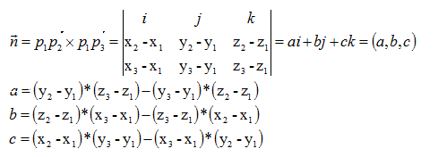

本次实验对应的代码实现如下：
```c
//计算叉积(未归一化)
VECTOR3 cross(const VERTEX& v0, const VERTEX& v1, const VERTEX& v2) {
    VECTOR3 v0_v1 = {v1.X - v0.X, v1.Y - v0.Y, v1.Z - v0.Z};
    VECTOR3 v0_v2 = {v2.X - v0.X, v2.Y - v0.Y, v2.Z - v0.Z};

    VECTOR3 fv =   {v0_v1.Y * v0_v2.Z - v0_v1.Z * v0_v2.Y,
                    v0_v1.Z * v0_v2.X - v0_v1.X * v0_v2.Z,
                    v0_v1.X * v0_v2.Y - v0_v1.Y * v0_v2.X}; // 平面法向量（未归一化，含面积信息）
    
    return fv;
}
```

#### 4.3.2 顶点法线的计算

核心思想：对顶点所有关联面的法向量作平均，但考虑到**更大的面理应占有更大的权重**，所以需要对各个面的单位向量进行加权平均，权重即时各个面的面积信息，使用4.3.1中的方式计算的法向量本身就包含面积信息，因此我们无需做进一步的处理。

遍历各面、将其法向量加到所有相关联的顶点上，即可使得顶点包含所有相关联面的信息：

```c
// 将带权法向量加到每一个顶点的法向向量上
for(int i = 0;i < 3;i++){
    int idx = it->VN[i];

    my_obj.VN[idx].NX += fv.X;
    my_obj.VN[idx].NY += fv.Y;
    my_obj.VN[idx].NZ += fv.Z;
}
```

求平均之后，我们还需对顶点的法向量做归一化，具体只需我们遍历所有法向量并除以其模长即可：

```c
//遍历顶点，归一化顶点方向向量
for(auto it = my_obj.VN.begin();it != my_obj.VN.end();it++){
    vn = &(*it);
    length = sqrt(vn->NX*vn->NX + vn->NY*vn->NY + vn->NZ*vn->NZ);
    vn->NX /= length;
    vn->NY /= length;
    vn->NZ /= length;
}
```

### 4.4 实现鼠标与键盘的交互功能
#### 4.4.1 使用鼠标控制视角的远近
设置一个全局变量scale用于存储模型放大或者缩小的倍率，调用``glScalef(scale, scale, scale)``来实现模型的放大与缩小。
值得一提的鼠标实现缩放时，缩放的倍数不能为负数或者是0，故定义缩放下界`LOWER_BOUND`；而缩放倍数过大时模型渲染会出问题，如图：

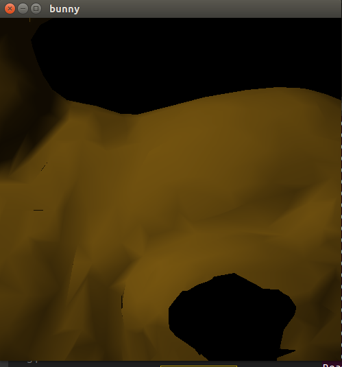

同理定义缩放上界`UPPER_BOUND`。
除此之外，本人设置了一个**计时器**，使得一直左键按下或者右键按下时模型可以每隔 200ms 放大或者缩小模型，直至松开鼠标。这样想要多次放大或者缩小模型就不用连续点击鼠标左键或者右键了。

相关的具体代码如下：

```c
//设置全局变量，用于缩放
void mouseClick(int button, int state, int x, int y) {
    mouse_state = state;
    if (state == GLUT_DOWN) {
        mouse_Button = button;
    }
}
```

```c
//设置计时器，使得鼠标左击每隔一段时间缩小，右击每隔一段时间放大，每次操作步幅为SCALE_GAP
void timer(int value) { 
    if (mouse_Button == GLUT_RIGHT_BUTTON && mouse_state == GLUT_DOWN) {
        if(scale>=UPPER_BOUND)
            printf("Reach the scale upper bound!\n");
        else
            scale += SCALE_GAP;
    }

    if (mouse_Button == GLUT_LEFT_BUTTON && mouse_state == GLUT_DOWN){
        if(scale<=LOWER_BOUND)    // 避免scale减小为非正值
            printf("Reach the scale lower bound!\n");
        else
            scale -= SCALE_GAP;
    }
    DrawScene();

    // 定时器函数，按下鼠标后每隔200ms调用一次即可实现连续缩放
    glutTimerFunc(200, timer, 0); // 设置下一次调用定时器的时间
}
```

#### 4.4.2 使用键盘控制模型的旋转
设置一个全局变量x_rotate和y_rotate用于存储模型上下旋转和左右旋转的角度，调用``glRotatef(x_rotate, 1.0f, 0.0f, 0.0f)``和``glRotatef(y_rotate, 0.0f, 1.0f, 0.0f)``来实现模型的旋转。
通过键盘的上下左右键来改变x_rotate和y_rotate，进而实现模型的旋转。
相关的具体代码如下：
```c
// 键盘上下左右键调整视角
void SpecialKeys(int key, int x, int y) {
    if (key == GLUT_KEY_UP) 
        x_rotate -= ROTATE_GAP;
    else if (key == GLUT_KEY_DOWN) 
        x_rotate += ROTATE_GAP;
    else if (key == GLUT_KEY_LEFT) 
        y_rotate -= ROTATE_GAP;
    else if (key == GLUT_KEY_RIGHT) 
        y_rotate += ROTATE_GAP;
    DrawScene();
}
```

#### 4.4.3 使用键盘控制模型的材质
本次实验中，除了要求的黄铜材质，本人还设计了蓝宝石，红宝石，绿宝石材质，只要键盘按下'1','2','3','4'即可实现材质的切换，具体实现方法是通过捕获键盘的'1','2','3','4'按键，改变全局变量``material``，然后重新进行绘画即可。相关代码如下：
```c
//指定用于光照计算的材质属性，参数FACE的取值GL_FRONT，GL_BACK，GL_FRONT_AND_BACK，决定材质属性用于哪一面
    switch(material){
        case 0:
            glMaterialfv(GL_FRONT, GL_AMBIENT, brass_ambient);      
            glMaterialfv(GL_FRONT, GL_DIFFUSE, brass_diffuse);     
            glMaterialfv(GL_FRONT, GL_SPECULAR, brass_specular);    
            glMaterialfv(GL_FRONT, GL_EMISSION, brass_matemission);    
            glMaterialf(GL_FRONT, GL_SHININESS, fShininess);        
            break;
        case 1:
            glMaterialfv(GL_FRONT, GL_AMBIENT, blue_sapphire_ambient);
            glMaterialfv(GL_FRONT, GL_DIFFUSE, blue_sapphire_diffuse);
            glMaterialfv(GL_FRONT, GL_SPECULAR, blue_sapphire_specular);
            glMaterialfv(GL_FRONT, GL_EMISSION, blue_sapphire_matemission);
            glMaterialf(GL_FRONT, GL_SHININESS, blue_sapphire_shininess);
            break;
        case 2:
            glMaterialfv(GL_FRONT, GL_AMBIENT, emerald_ambient);
            glMaterialfv(GL_FRONT, GL_DIFFUSE, emerald_diffuse);
            glMaterialfv(GL_FRONT, GL_SPECULAR, emerald_specular);
            glMaterialfv(GL_FRONT, GL_EMISSION, emerald_matemission);
            glMaterialf(GL_FRONT, GL_SHININESS, emerald_shininess);
            break;
        case 3:
            glMaterialfv(GL_FRONT, GL_AMBIENT, ruby_ambient);
            glMaterialfv(GL_FRONT, GL_DIFFUSE, ruby_diffuse);
            glMaterialfv(GL_FRONT, GL_SPECULAR, ruby_specular);
            glMaterialfv(GL_FRONT, GL_EMISSION, ruby_matemission);
            glMaterialf(GL_FRONT, GL_SHININESS, ruby_shininess);
            break;
        default:
            glMaterialfv(GL_FRONT, GL_AMBIENT, brass_ambient);      
            glMaterialfv(GL_FRONT, GL_DIFFUSE, brass_diffuse);  
            glMaterialfv(GL_FRONT, GL_SPECULAR, brass_specular);   
            glMaterialfv(GL_FRONT, GL_EMISSION, brass_matemission);    
            glMaterialf(GL_FRONT, GL_SHININESS, fShininess);        
            break;
    }
```

#### 4.4.4 使用键盘控制光照强度
本次实验中，本人还设计了通过键盘控制光照强度的功能，具体实现方法是通过捕获键盘的'w','s'按键，改变全局变量``light``，然后重新进行绘画即可。设置光照强度可以通过``glLightfv(GL_LIGHT0, GL_DIFFUSE, light_intensity)``函数实现，对光照强度本人也设置了上界与下界。具体相关代码如下：

捕获键盘输入：
```c
void keyboard(unsigned char key, int x, int y) {
    switch (key) {
        //键盘1234定义物体材质
        case '1':
            material = 0;
            break;
        case '2':
            material = 1;
            break;
        case '3':
            material = 2;
            break;
        case '4':
            material = 3;
            break;
        //键盘ws修改光照强度
        case 'w':
            if(light >= MAX_LIGHT)
                printf("Reach the light upper bound!\n");
            else
                light += LIGHT_GAP;
            break;
        case 's':
            if(light <= MIN_LIGHT)
                printf("Reach the light lower bound!\n");
            else
                light -= LIGHT_GAP;
            break;
        default:
            return;
    }
    DrawScene();
}
```

设置光照强度：
```c
GLfloat light_intensity[4];//光源强度
for(int i = 0;i < 3;i++){
    light_intensity[i] = light;
}
light_intensity[3] = 1.0f;
glLightfv(GL_LIGHT0, GL_DIFFUSE, light_intensity);
```


## 5.实验设计与效果

本次实验的核心代码已在4.3与4.4中进行阐释，其余值得交代的便是控制使用自计算顶点向量的宏`CALC_NORMAL`，若编译时不定义该宏即会默认读取模型中的法向量，具体实现如下：

```c
    ...
#ifndef CALC_NORMAL
    string head;
    in >> head >> vn->NX >> vn->NY >> vn->NZ;
#else
    vn->NX=vn->NY=vn->NZ=0;
#endif
    my_obj.VN.push_back(*vn);
    ...
```
```c
void Init_scene() {
#ifdef CALC_NORMAL
    Calc_NORMAL();
#endif
    ...
}
```

最终运行效果如下：
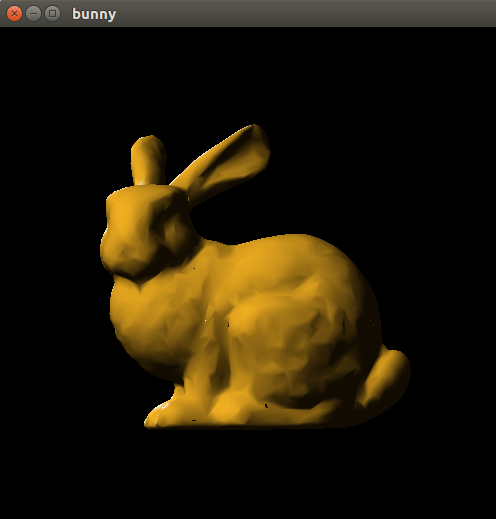

模型缩小与放大的效果
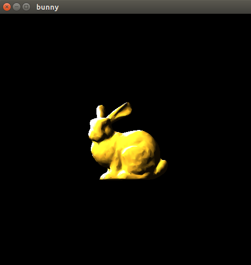
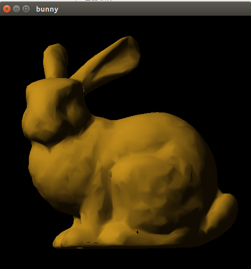

模型左右与上下旋转的效果
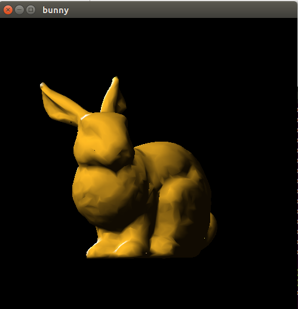
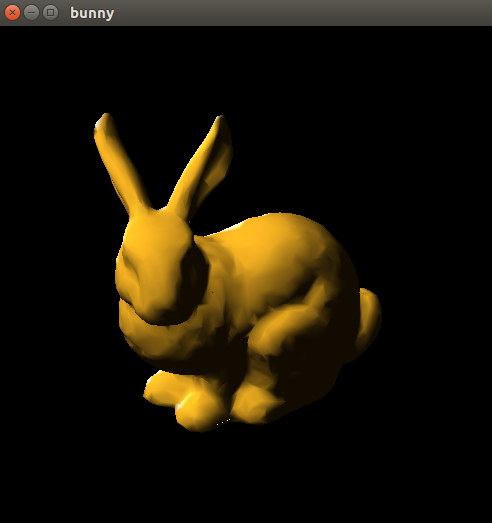

模型切换不同材质的效果
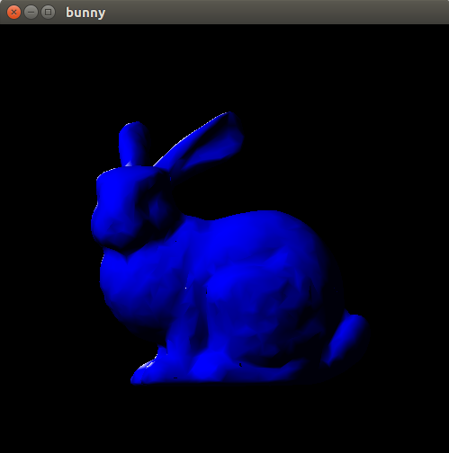
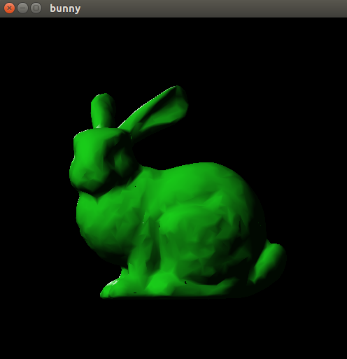
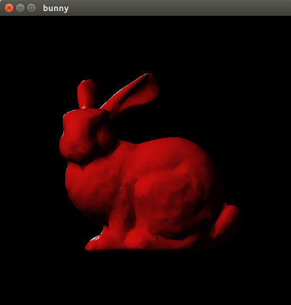

改变光照强度的效果
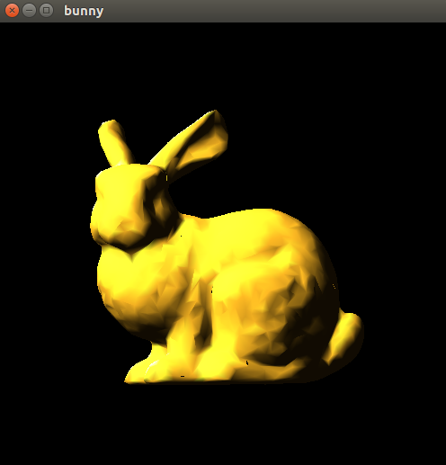
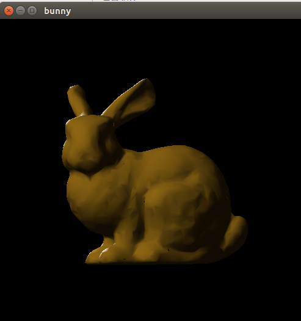

