# EXAM 3说明文档

<center>
    2021K8009929010 贾城昊
</center>

[TOC]

## 1. 代码明细
```
.
├── build                             
│   └── main                          #生成的可执行文件
├── code                              #代码文件夹            
│   ├── head.h                        #头文件
│   ├── main.cpp                      #主函数
│   ├── main.o
│   ├── show_model.cpp                #渲染相关函数
│   ├── show_model.o
│   ├── simplify.cpp                  #简化相关函数
│   └── simplify.o
├── img                               #实验结果图像文件夹，用于Readme展示实验结果
│   ├── image10.png
│   ├── image11.png
│   ├── image12.png
│   ├── image13.png
│   ├── image14.png
│   ├── image15.png
│   ├── image16.png
│   ├── image17.png
│   ├── image18.png
│   ├── image1.png
│   ├── image2.png
│   ├── image3.png
│   ├── image4.png
│   ├── image5.png
│   ├── image6.png
│   ├── image7.png
│   ├── image8.png
│   └── image9.png
├── input                             
│   └── dragon.obj                      #输入文件（待简化的源文件）
├── Makefile                            #Makefile文件
├── output                              #输出文件夹
│   ├── output-dragon-0.25-face.obj     #简化比为0.25的模型（以面的数量作为简化比）
│   ├── output-dragon-0.25-vertex.obj   #简化比为0.25的模型（以点的数量作为简化比）
│   ├── output-dragon-0.5-face.obj      #简化比为0.5的模型（以面的数量作为简化比）
│   ├── output-dragon-0.5-vertex.obj    #简化比为0.5的模型（以点的数量作为简化比）
│   ├── output-dragon-0.75-face.obj     #简化比为0.75的模型（以面的数量作为简化比）
│   └── output-dragon-0.75-vertex.obj   #简化比为0.75的模型（以点的数量作为简化比）
├── Readme.md                           
└── Readme.pdf                          #Readme的PDF版本
```
`input` 文件夹下存放输入文件
`output`文件夹下存放的是输出，其倒数第二个后缀代表简化的比例，最后一个后缀代表以点的数量还是以面的数量作为简化比。
`code` 文件夹下存放源代码

## 2. 环境配置

本次实验使用了OpenMesh库，便于获取点、边、面关系，以及Eigen库，辅助矩阵计算。

### 2.1 Eigen库的下载安装与配置

Linux：

```bash
sudo apt-get install libeigen3-dev
```
然后把Eigen库的安装路径下的文件复制到`/usr/include`中，具体来说可以用`whereis eigen3`获得路径，如下所示：
```bash
whereis eigen3
# 本人的输出结果是/usr/include/eigen3，则继续执行下面命令
sudo cp -r /usr/include/eigen3/Eigen /usr/include 
```

Windows：
由于本人是在Linux上进行实验，Windows的环境配置过程没有具体进行，但可以参考下面的文章

[全网最简洁安装Eigen库方法(Win端+VScode)](https://blog.csdn.net/qq_45948208/article/details/132434560)

[Eigen库安装使用](https://blog.csdn.net/weixin_43763284/article/details/132211286)

### 2.2 cmake工具的下载安装
在配置OpenMesh库之前，需要先安装cmake工具。

Linux:
在Linux下，直接输入如下命令即可
```bash
sudo apt-get update
sudo apt-get install cmake
```

Windows:
前往 CMake 官方网站 下载最新的 Windows 安装程序。
如果你使用 Chocolatey 包管理器，可以在管理员权限的 PowerShell 中运行以下命令：
```bash
choco install cmake
```
如果你使用 Scoop 包管理器，可以在 PowerShell 中运行以下命令：
```bash
scoop install cmake
```
在终端或命令提示符中运行 cmake --version 来验证安装是否成功


### 2.3 OpenMesh在Linux中的配置
#### 2.3.1 下载安装
本人的配置参考了下面文章，个人觉得还是很详细的
[ubuntu安装openmesh - 简书](https://www.jianshu.com/p/6c0d89839fdd)
具体过程如下：

在官网下载openmesh的源码(.tar.gz文件或者.tar.bz2文件)：

> https://www.graphics.rwth-aachen.de/software/openmesh/download/

获取安装链接后，在终端输入：

```bash
# 本人下载的.tar.gz文件
wget https://www.graphics.rwth-aachen.de/media/openmesh_static/Releases/10.0/OpenMesh-10.0.0.tar.gz
```

下载完毕后进行解压：
```bash
tar -zxvf OpenMesh-10.0.0.tar.gz
```

进入解压的目录，然后创建文件夹build:
```bash
# cd到解压的目录
cd OpenMesh-10.0.0/
mkdir build
```

进入build文件夹并且cmake：

```bash
cd build
cmake ..
```

出现`Configuring done`和`Generating done`后在当前目录的终端输入（可能会报错未安装Qt，无需管）：

```bash
make
```
> 如果想要开机多线程编译的话，加参数“-j [线程数量]”，例如make -j 4

等待编译完成后（进度为100%），移动所有编译好的库文件到 /usr/local/lib/ 目录下：
```bash
# 注意是编译库文件的目录，下面只是本人的示例
sudo mv /home/user/Downloads/OpenMesh-10.0.0/build/Build/lib/* /usr/local/lib/
```
接着将包含所需头文件的文件夹移动到 /usr/local/include/ 目录下：
```bash
sudo mv /home/user/Downloads/OpenMesh-10.0.0/src/OpenMesh/ /usr/local/include/
```

运行 `ldconfig` 命令，以便在运行需要该库的应用程序时，库加载器能够找到它：
```bash
sudo ldconfig -v
```

为了验证，运行 
```bash
ldconfig -p | grep OpenMesh
```
它应该打印出包含 OpenMeshCore 和 OpenMeshTools 的一些库名称。

#### 2.3.2 建立项目

在OpenMesh的官网的指导书里给出如何使用Cmakelist.txt建立自己的项目：

> [OpenMesh: How to create your own project using OpenMesh (rwth-aachen.de)](https://www.graphics.rwth-aachen.de/media/openmesh_static/Documentations/OpenMesh-Doc-Latest/a05935.html)

但是这种方法较为麻烦，需要把项目建立在`/src/OpenMesh/Apps`文件夹内，并在项目文件内编写`Cmakelist.txt`，后在外层的`Cmakelist.txt`中再加上项目目录。
考虑直接在g++编译时连接上库即可（在上面我们安装OpenMesh时已经将库加入了`/usr/local/lib/`）。

使用官网给出的测试用例并使用如下命令编译：
```bash
gcc main.c -o main -lOpenMeshTools -lOpenMeshCore
```

发现可正常编译
运行可执行文件后生成`output.off`，使用MeshLab查看：
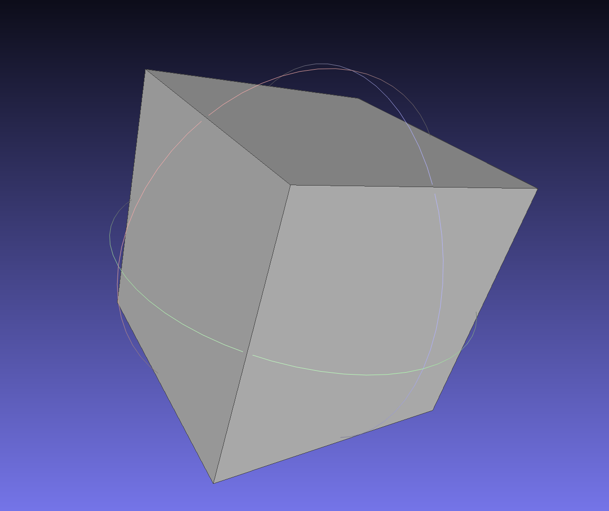

### 2.4 OpenMesh在Windows环境的配置

Windows下配置OpenMesh环境比较复杂，而且需要首先下载VS，具体可以参考下面文章：
[【OpenMesh】Windows下OpenMesh的安装使用](https://blog.csdn.net/qq_43331089/article/details/125087965/)
[Windows下OpenMesh的安装使用](https://blog.csdn.net/guoyihaoguoyihao/article/details/104446406/)

## 3.程序编译命令
编写了Makefile，重要参数如下：
- `RATIO`：修改待简化的比例；
- `INPUT`：输入文件的路径；
- `SRC`：指定源文件路径
- `LOG_NAME`：指定输出log的路径
- `OBJ_NAME`：指定简化后的模型的路径

命令说明：

- `make all`：创建必要的文件夹并编译链接生成可执行文件
- `make clean`：删除编译链接产生的`.o`文件和可执行文件
- `make run`：运行可执行文件（参数`EXE_ARGS`可在Makefile中修改）
- `make log`：运行可执行文件的同时将输出保存在output文件夹下的`.log`文件内。

```makefile
#
# 'make'        build executable file 'main'
# 'make clean'  removes all .o and executable files
#

# define the Cpp compiler to use
CXX = g++

# define any compile-time flags
CXXFLAGS	:= -std=c++17 -Wall -Wextra -g

# define library paths in addition to /usr/lib
#   if I wanted to include libraries not in /usr/lib I'd specify
#   their path using -Lpath, something like:
LFLAGS = 

# define compile result directory
BUILD := build

# define source directory
SRC		:= code

# define relevant libs
LIBRARIES	:= -lOpenMeshTools -lOpenMeshCore -lglut -lGLU -lGL

# define flags used for excuting
RATIO	:= 0.25
INPUT	:= $(wildcard input/*.obj)
OUTPUT	:= output
PREFIX  := $(OUTPUT)/$(strip $(basename $(notdir $(INPUT)))$(subst .,_,$(RATIO)))
LOG_NAME:= $(addsuffix .log ,$(PREFIX))
OBJ_NAME:= $(addsuffix .obj ,$(PREFIX))
EXE_FLAGS := $(INPUT) $(OBJ_NAME) $(RATIO)

ifeq ($(OS),Windows_NT)
MAIN	:= main
SOURCEDIRS	:= $(SRC)
FIXPATH = $(subst /,\,$1)
RM			:= del /q /f
MD	:= mkdir
else
MAIN	:= main
SOURCEDIRS	:= $(shell find $(SRC) -type d)
FIXPATH = $1
RM = rm -f
MD	:= mkdir -p
endif

# define the C source files
SOURCES		:= $(wildcard $(patsubst %,%/*.cpp, $(SOURCEDIRS)))

# define the C object files 
OBJECTS		:= $(SOURCES:.cpp=.o)

#
# The following part of the makefile is generic; it can be used to 
# build any executable just by changing the definitions above and by
# deleting dependencies appended to the file from 'make depend'
#

OUTPUTMAIN	:= $(call FIXPATH,$(BUILD)/$(MAIN))

all: $(BUILD) $(OUTPUT) $(MAIN)
	@echo Executing 'all' complete!

$(BUILD):
	$(MD) $(BUILD)

$(OUTPUT):
	$(MD) $(OUTPUT)

$(MAIN): $(OBJECTS) 
	$(CXX) $(CXXFLAGS) -o $(OUTPUTMAIN) $(OBJECTS) $(LFLAGS) $(LIBRARIES) 

# this is a suffix replacement rule for building .o's from .c's
# it uses automatic variables $<: the name of the prerequisite of
# the rule(a .c file) and $@: the name of the target of the rule (a .o file) 
# (see the gnu make manual section about automatic variables)
.cpp.o:
	$(CXX) $(CXXFLAGS) -c $<  -o $@

.PHONY: clean
clean:
	$(RM) $(OUTPUTMAIN)
	$(RM) $(call FIXPATH,$(OBJECTS))
	@echo Cleanup complete!

run: all
	./$(OUTPUTMAIN) $(EXE_FLAGS)
	@echo Executing 'run: all' complete!

log: all
	./$(OUTPUTMAIN) $(EXE_FLAGS) >>  $(LOG_NAME) 2>&1
	@echo Executing complete! Saving log at $(LOG_NAME)!
```


## 4. 运行方式与实验结果
### 4.1 运行方式
代码可以通过Makefile运行，make run的参数可在Makefile中进行修改，指定输入文件路径，输出文件路径与简化比率。
如果只使用Makefile生成可执行文件，则有两种方式来运行可执行文件
一个是可以通过命令行参数：
可以通过在控制台输入参数直接运行程序。例如：
```bash
./main ../input/dragon.obj ../output/output-dragon.obj 0.25
```
其中，`../input/dragon.obj` 是输入文件路径，`../output/output-dragon.obj` 是输出文件路径，0.25 是简化比例。
也可以交互式输入：
直接运行程序，然后按照提示逐个输入参数：
```bash
./main
```
程序将提示您输入文件路径、输出文件路径和简化比例，如下：
```bash
please input the path of input OBJ file
../input/dragon.obj
please input the path of output OBJ file
../output/output-dragon.obj
please input the ratio of simplification
0.25
```


### 4.2 代码宏的说明

四个宏开关的作用：

- *SHOW_EDGE*：在最后渲染时是否显示网格边的信息，具体效果区别如下（均以网格简化0.5为例）：
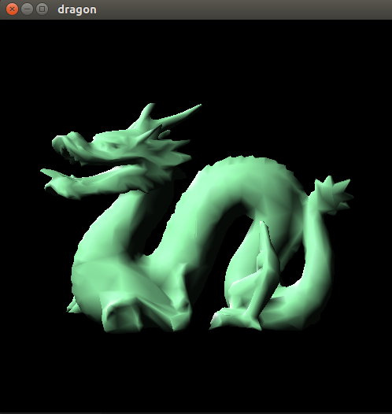
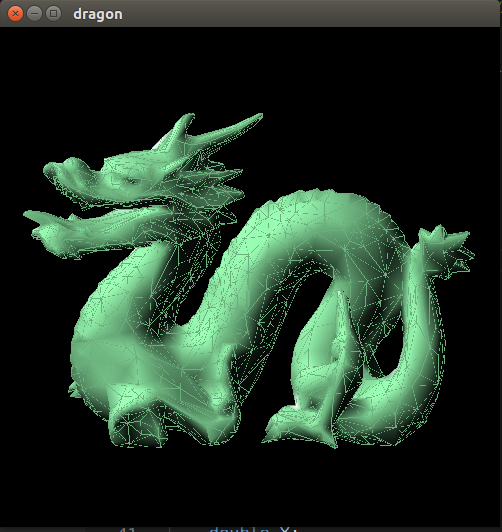

- *CONSIDER_NO_EDGE*：网格简化时是否考虑没有边相连的点对.
- *SAME_NORMAL*：在最后渲染时是否将一个面的三个点的法向量取平均值(在后面会展示效果).
- *FACES_TARGET* ：网格简化比例是根据面数量计算还是根据点数量计算

### 4.3 实验结果
下面的实验结果均是以点的数量作为简化比例。
以下为在最后渲染时，不对法向量求平均的简化0.75，0.5，0.25的实验运行结果：
简化0.75的渲染图：
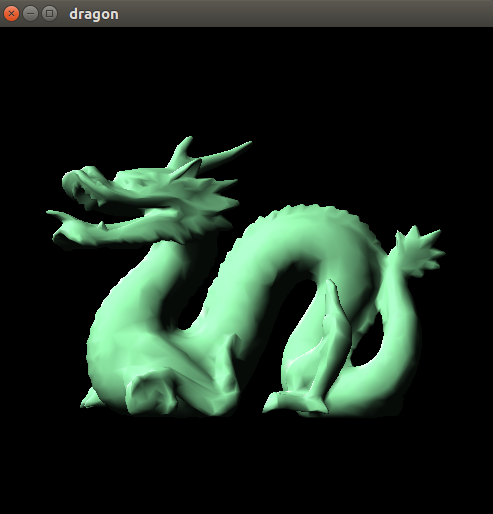
简化0.5的渲染图：
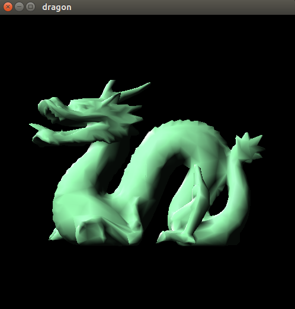
简化0.25的渲染图：
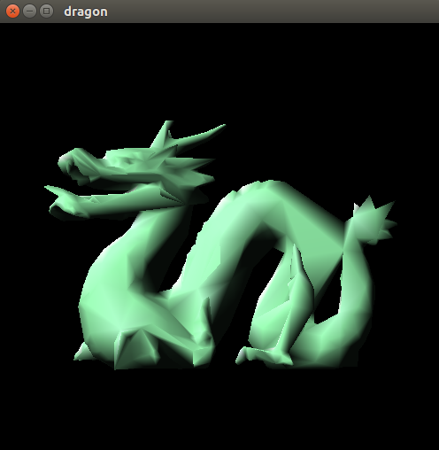

以下为在最后渲染时，对法向量求平均的简化0.75，0.5，0.25的实验运行结果：
简化0.75的渲染图：
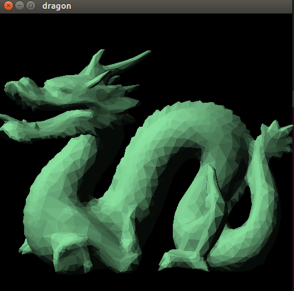
简化0.5的渲染图：
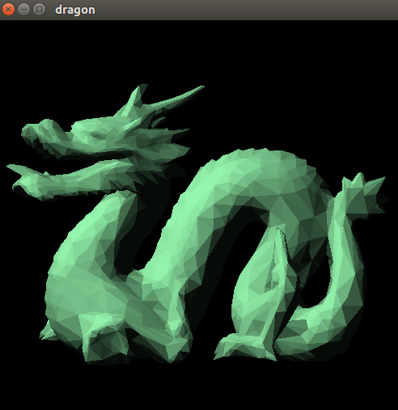
简化0.25的渲染图：
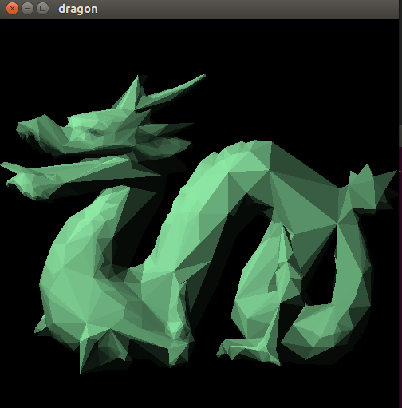

MeshLab的可视化结果：
原文件的MeshLab显示图：
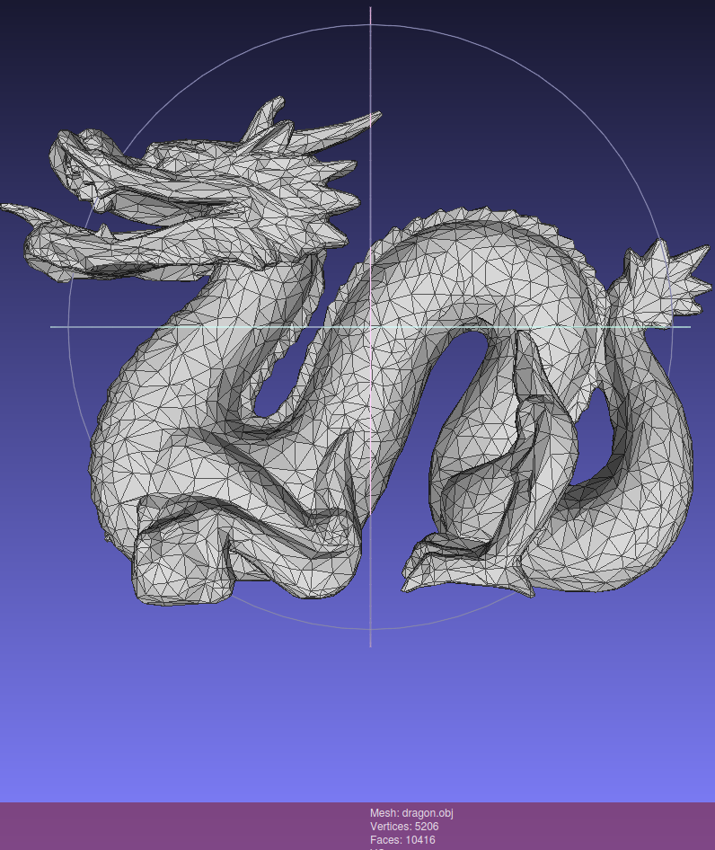
可见总共有5206个点，10416个面。
简化0.75的MeshLab显示图：
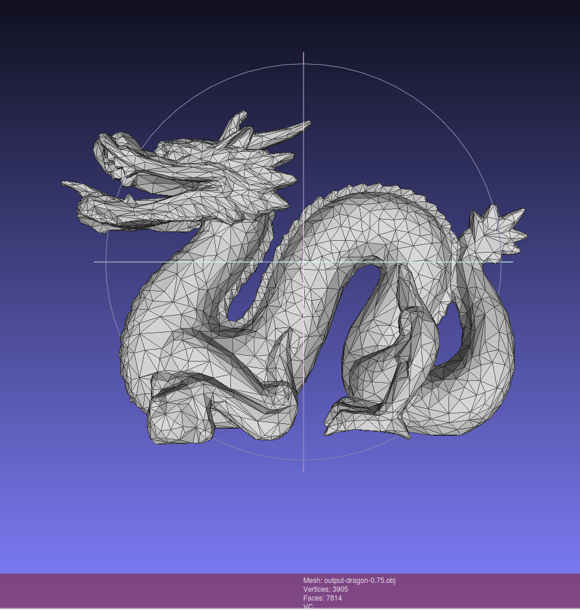
可见总共有3905个点，7814个面，简化比确实为0.75，且总体形状基本保持不变。
简化0.5的MeshLab显示图：
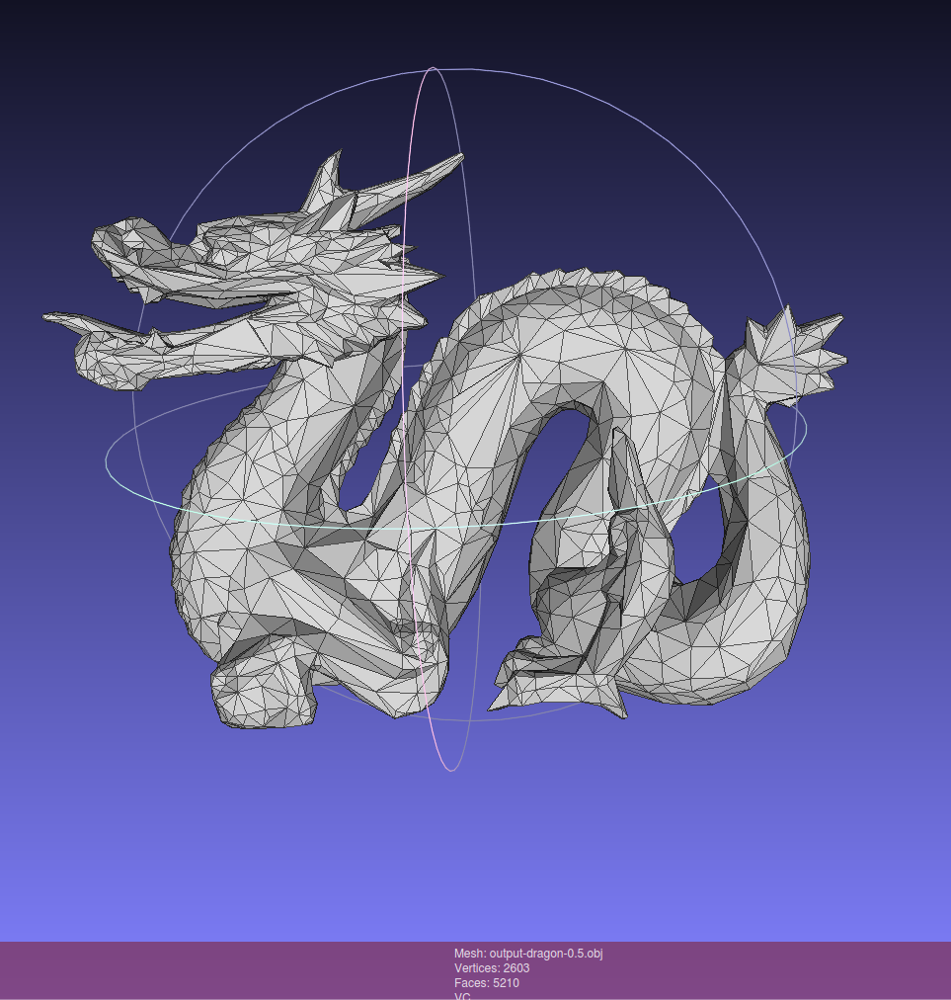
可见总共有2603个点，5210个面，简化比确实为0.5，且总体形状基本保持不变。
简化0.25的MeshLab显示图：
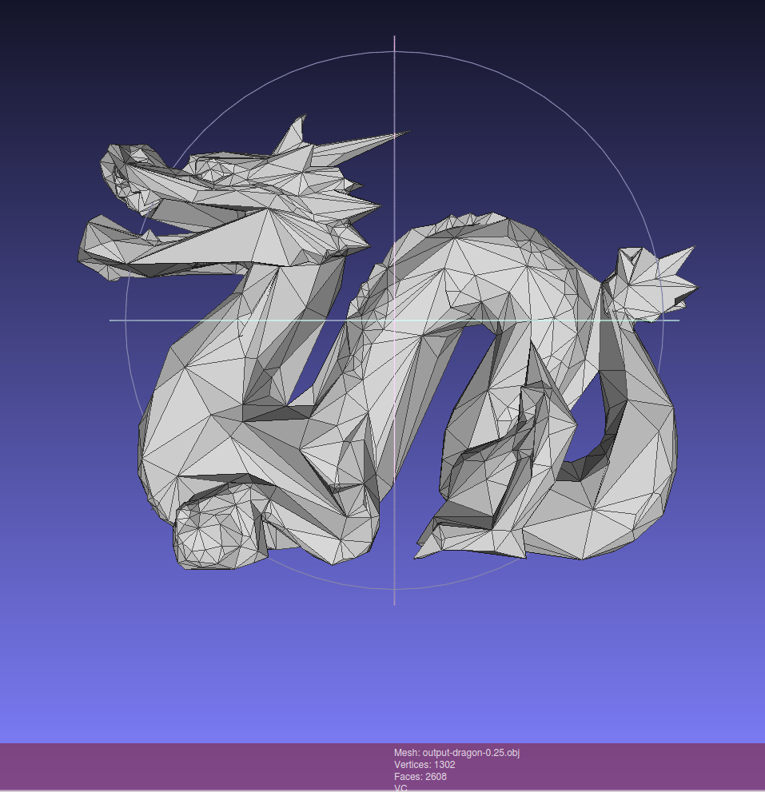
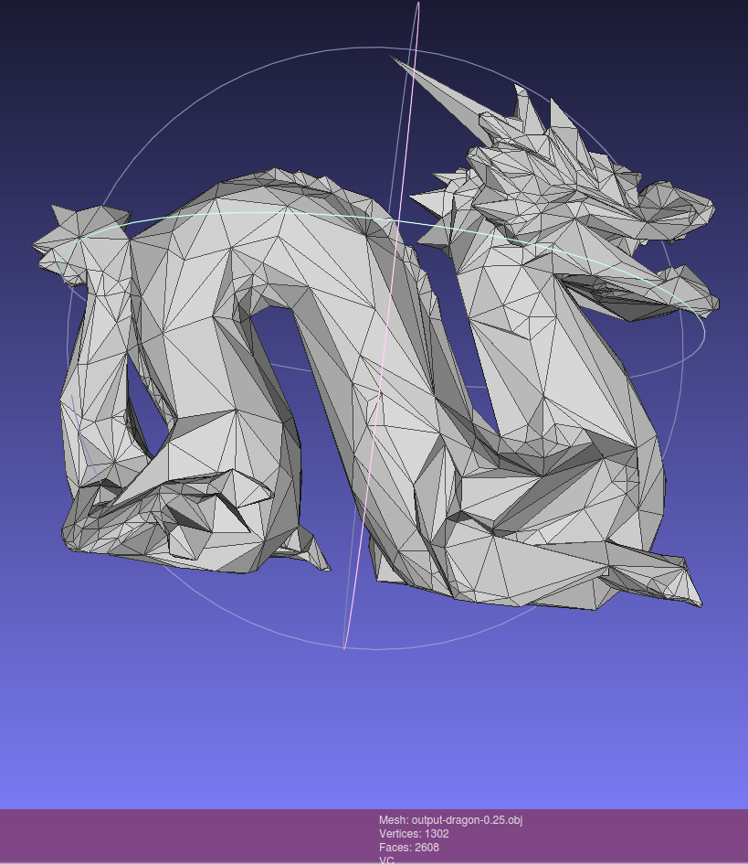
可见总共有1302个点，2608个面，简化比确实为0.25，且总体形状基本保持不变。
可以看出，即使简化比到达了0.25，仍然可以保持较为完整的形状，并且模型没有出现明显的瑕疵（例如空洞等），可以看出总的来说，网格简化的效果还是很好的。

由于上面以点的数量作为简化比例，所以面的数量并不完全等于原文件的面数乘以对应比例，但差距不大。
如果定义了`FACES_TARGET`的宏，则可以以面的数量作为简化比例，例如0.25，0.5，0.75简化比率下的MeshLab显示图：
简化0.25的MeshLab显示图：
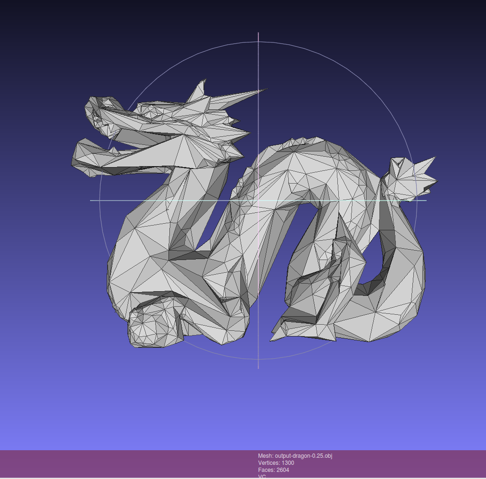
简化0.5的MeshLab显示图：
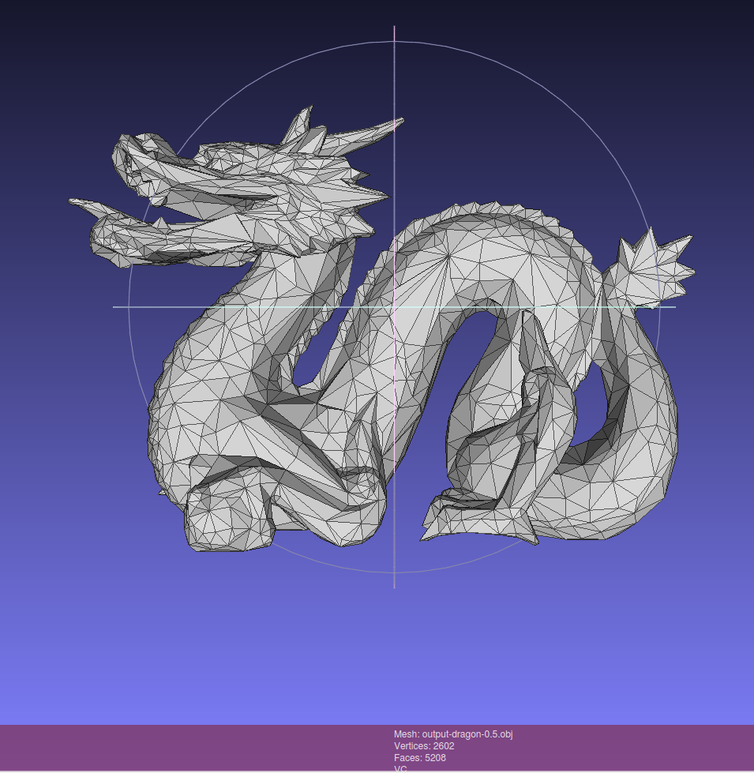
简化0.75的MeshLab显示图：
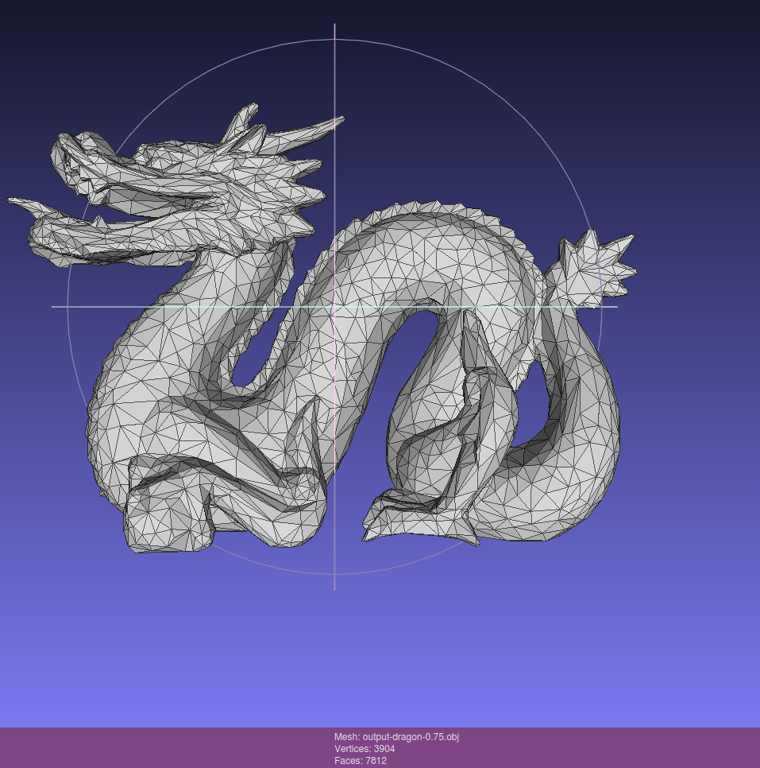
可以看出，面数确实严格等于源文件面数乘以简化比例

在最终的渲染的部分，功能仍然与上次实验一致，但加了一个可以切换的材质，具体来说如下：
- 使用鼠标控制视角的远近(长时间按下鼠标左右键可以实现连续缩放)
- 通过键盘的上下左右键实现模型的旋转
- 通过键盘的'1','2','3','4','5'按键修改模型材质
- 通过键盘'w','s','W','S'控制光照强度的功能

具体的代码介绍与实现可以参考上次实验的Readme

### 4.4 算法介绍与复杂度分析
本次网格简化实验使用了基于二次误差度量的网格简化算法，下面给出两个本人觉得很有参考意义的讲述这个算法的文章：
[网格简化(QEM)学习笔记](https://blog.csdn.net/qq_39784672/article/details/132053304)
[QEM网格简化算法](https://blog.csdn.net/chenbb1989/article/details/124696668)
算法大致流程如下：
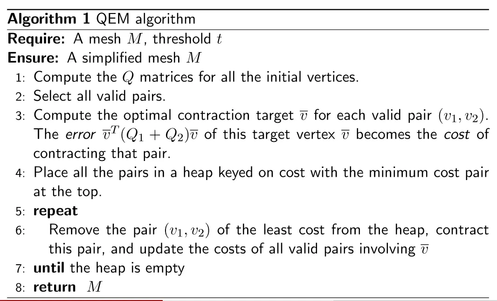
但是，在具体实现时，与上面有略微不同，本人的排序并没有维护一个堆，而是在初始化时采用的快速排序，在后续的简化过程中，每简化一个点对，都把与之相关的项删除（查找的过程也是二分查找），然后将新产生的项用折半插入的方式插入到有序表中。
不过从复杂度的角度来说，第一次快速排序的复杂度是O(nlogn)，后续的删除和插入均是O(logn)，与维护一个堆的复杂度一致。

在具体实现时，本人起初的想法是把所有的点对均加入到有序表中，然后在后面对这个有序表进行操作即可。但这样不仅会占用大量的内存，而且若点的数量为n，排序的复杂度就变成了O(\(n^2 \log n\))，而且维护也很费时间，一次简化的时间很长。
在进一步阅读相关资料后，本人的做法是首先会对点的距离设定一个阈值（虽然这个是算法的一部分，但最初本人忽略了这个点），距离小于这个阈值才会删除。其次并不用存储所有的点对，只用在每次简化后，计算新点和其它点的cost，然后与比较有序表中的最小值进行比较即可，这样这次操作的复杂度变成了O(n)。
本人有想过如何进一步降低复杂度，但最后鉴于本人的实力与水平，如果考虑没有边相连的点对，复杂度无法再降低了。
所以可以看到，如果只考虑边，复杂度为O(eloge)，考虑所有的点对，复杂度为O(\(n^2\) + eloge)，其中e为边的数量，n为点的数量。

最终即使是在简化比率为0.25时，在本地电脑上的简化操作所花费的时间仍然不超过10s。

### 4.5 代码函数功能简介
本实验定义的函数如下所示：
```cpp
// show_model.cpp
void Calc_NORMAL();
void Set_material();
void Init_scene();
void GLCube();
void DrawScene();
void SpecialKeys(int key, int x, int y);
void keyboard(unsigned char key, int x, int y);
void timer(int value);
void mouseClick(int button, int state, int x, int y);
void show_model(int argc, char* argv[]);
// simplify.cpp
Matrix4d ComputeQ(MyMesh::VertexHandle vh);
void Add_Q();
bool computeQEM(EdgeInfo& edge_info, const MyMesh::EdgeHandle& e);
void Add_EdgeInfo();
bool cost_cmp(const MyMesh::EdgeHandle& e1, const MyMesh::EdgeHandle& e2);
void SortEdges();
bool deleteAdjacentEdges(const MyMesh::VertexHandle v);
void UpdateEdgeInfo(const MyMesh::VertexHandle v);
void Delete_Vertex(const MyMesh::EdgeHandle& e, int& total);
void simplify(int total);
void MeshPropInit();
void MeshPropDel();

bool No_edge_cost(EdgeInfo& edge_info, const MyMesh::VertexHandle v1, const MyMesh::VertexHandle v2);
bool Delete_Vertex_no_edge(EdgeInfo edge_info, const MyMesh::VertexHandle v1, const MyMesh::VertexHandle v2);
bool Compare_Vertex_pair_cost(const MyMesh::VertexHandle v);
bool HasDuplicatedVertex();
int RemoveDuplicatedVertex(const MyMesh::VertexHandle v1, const MyMesh::VertexHandle v2);

void showProgressBar(int progress, int total);
```
重点介绍网格简化相关的函数，与渲染相关函数可以参考上个实验的Readme
- `ComputeQ` : 计算每个顶点Q矩阵
- `Add_Q` ： 为每个点添加Q矩阵属性
- `computeQEM` ： 计算一条边的最小收缩误差cost和最佳收缩点
- `Add_EdgeInfo` ： 为每条边添加最小收缩误差cost和最佳收缩点属性
- `cost_cmp` ： 边的比较函数，比较cost，用于快速排序
- `SortEdges` ： 给所有的边进行快速排序
- `deleteAdjacentEdges` ： 删除与点有关的边，用于简化网格
- `UpdateEdgeInfo` : 删除点并添加新点后更新边属性，用于后续继续简化网格
- `Delete_Vertex` ： 单步简化操作，使总点数至少减一
- `simplify` ： 简化总函数
- `MeshPropInit` ： 初始化网格属性，用于简化开始前
- `MeshPropDel` ： 回收网格属性，用于简化结束后
- `No_edge_cost` ： 计算无边相连点对的最小收缩误差cost和最佳收缩点
- `Delete_Vertex_no_edge` ： 删除无边相连点对，添加收缩点
- `Compare_Vertex_pair_cost` ： 用于判断是否存在点对的cost小于边的最小cost，用于网格简化
- `HasDuplicatedVertex` ： 用于判断网格是否存在重复点
- `RemoveDuplicatedVertex` ： 用于删除网格中的重复点，用于网格简化
- `showProgressBar` : 用于显示简化进度条

限于篇幅，本人就不再详细介绍每个函数的功能了，具体实现可以参考代码。