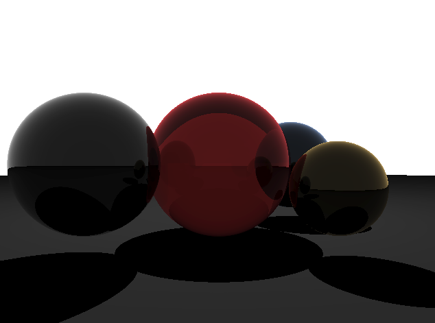
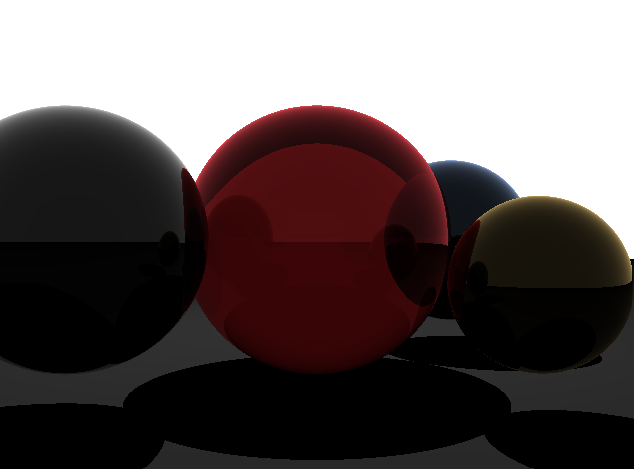
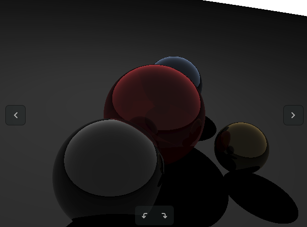
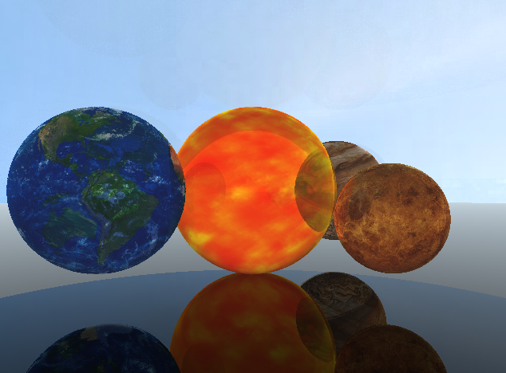
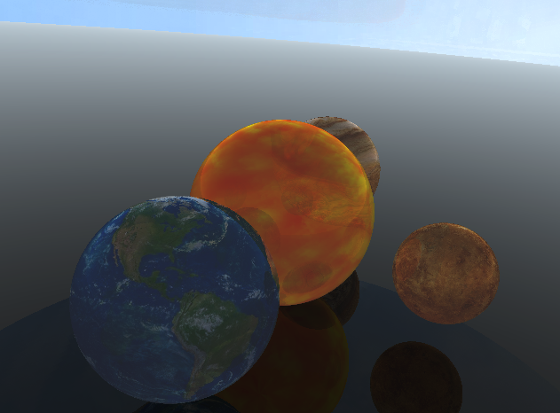
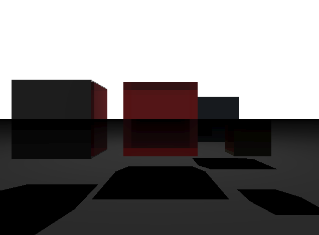
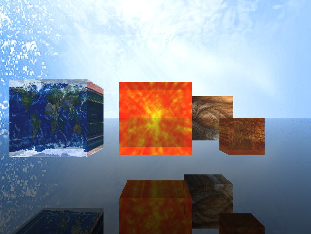
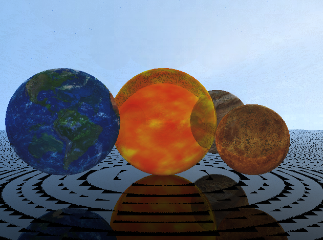

# EXAM 4说明文档

<center>
    2021K8009929010 贾城昊
</center>

[TOC]

## 1. 代码明细

```makefile
.
├── build                       # 编译后的可执行文件
│   └── main
├── code                        # 源代码
│   ├── head.h  
│   ├── main.cpp                # 主函数
│   ├── main.o
│   ├── show_pic.cpp            # 渲染显示图片
│   ├── show_pic.o
│   ├── stb_image.h             # 图片读取
│   ├── trace.cpp               # 光线追踪函数
│   ├── trace.h                 # 光线追踪相关对象
│   └── trace.o
├── img                         # 用于Readme的图片
│   ├── image.png
│   ├── image-1.png
│   ├── image-2.png
│   ├── image-3.png
│   ├── image-4.png
│   ├── image-5.png
│   ├── image-6.png
│   └── image-7.png
├── input                       # 纹理输入图片
│   ├── 0.jpg   
│   ├── 1.jpg
│   ├── 2.jpg
│   ├── 3.jpg
│   └── 4.jpg
├── Makefile                    # Makefile文件
├── output                      # 输出图片
│   ├── 1.ppm                   # 1-4 是球体（立方体）有（无）纹理的渲染图片
│   ├── 2.ppm
│   ├── 3.ppm
│   ├── 4.ppm
│   ├── frame0.ppm              # frame0-frame59 是球体有纹理的60帧的渲染图片（由于文件大小的限制，提交文件不包含，但实验服务器里面有）
│   ├── frame1.ppm
│   ├── frame2.ppm
│   ├── ...
│   ├── frame58.ppm
│   └── frame59.ppm
├── output-video                # 输出视频
│   ├── output_video_0.mp4      # 球体无纹理的渲染展示视频
│   └── output_video_1.mp4      # 球体有纹理的渲染展示视频
├── Readme.md                   
└── Readme.pdf                  # Readme的PDF版本

```

`input` 文件夹下存放纹理图片
`output`文件夹下存放的是渲染图片输出
`output-video`文件夹下存放的是渲染视频输出
`code` 文件夹下存放源代码


## 2. 环境配置
需要使用到ffmpeg制作视频，Linux直接输入下面命令即可：
```bash
apt install ffmpeg
```

## 3.程序编译命令
编写了Makefile，命令说明：

- `make all`：创建必要的文件夹并编译链接生成可执行文件
- `make clean`：删除编译链接产生的`.o`文件和可执行文件
- `make run`：运行可执行文件

```makefile
#
# 'make'        build executable file 'main'
# 'make clean'  removes all .o and executable files
#

# define the Cpp compiler to use
CXX = g++

# define any compile-time flags
CXXFLAGS	:= -std=c++17 -Wall -Wextra -g

# define library paths in addition to /usr/lib
#   if I wanted to include libraries not in /usr/lib I'd specify
#   their path using -Lpath, something like:
LFLAGS = 

# define compile result directory
BUILD := build

#define output dir
OUTPUT  := output

# define source directory
SRC		:= code

# define relevant libs
LIBRARIES	:= -lglut -lGLU -lGL


ifeq ($(OS),Windows_NT)
MAIN	:= main
SOURCEDIRS	:= $(SRC)
FIXPATH = $(subst /,\,$1)
RM			:= del /q /f
MD	:= mkdir
else
MAIN	:= main
SOURCEDIRS	:= $(shell find $(SRC) -type d)
FIXPATH = $1
RM = rm -f
MD	:= mkdir -p
endif

# define the C source files
SOURCES		:= $(wildcard $(patsubst %,%/*.cpp, $(SOURCEDIRS)))

# define the C object files 
OBJECTS		:= $(SOURCES:.cpp=.o)

#
# The following part of the makefile is generic; it can be used to 
# build any executable just by changing the definitions above and by
# deleting dependencies appended to the file from 'make depend'
#

OUTPUTMAIN	:= $(call FIXPATH,$(BUILD)/$(MAIN))

all: $(BUILD) $(OUTPUT) $(MAIN)
	@echo Executing 'all' complete!

$(BUILD):
	$(MD) $(BUILD)

$(OUTPUT):
	$(MD) $(OUTPUT)

$(MAIN): $(OBJECTS) 
	$(CXX) $(CXXFLAGS) -o $(OUTPUTMAIN) $(OBJECTS) $(LFLAGS) $(LIBRARIES) 

# this is a suffix replacement rule for building .o's from .c's
# it uses automatic variables $<: the name of the prerequisite of
# the rule(a .c file) and $@: the name of the target of the rule (a .o file) 
# (see the gnu make manual section about automatic variables)
.cpp.o:
	$(CXX) $(CXXFLAGS) -c $<  -o $@

.PHONY: clean
clean:
	$(RM) $(OUTPUTMAIN)
	$(RM) $(call FIXPATH,$(OBJECTS))
	@echo Cleanup complete!

run: all
	./$(OUTPUTMAIN) 
	@echo Executing 'run: all' complete!
```

## 4. 运行方式与实验结果
### 4.1 运行方式
代码可以通过Makefile运行，直接输入``make run``即可，会默认使用``../input``作为纹理输入路径，``../output``作为输出图片路径
如果只使用Makefile生成可执行文件，则有两种方式来运行可执行文件
一个是可以通过命令行参数：
可以通过在控制台输入参数直接运行程序。例如：
```bash
./main ../input/ ../output/
```
其中，`../input/` 是纹理输入文件夹路径，`../output/` 是输出文件图片保存文件夹路径。
也可以直接运行程序：
```bash
./main
```
会默认使用``../input``作为纹理输入路径，``../output``作为输出图片路径


### 4.2 代码宏的说明
本实验设置了较多的代码宏，对应了不同的功能
四个宏开关的作用：

- *GEOMETRIC*：用于球体求交使用几何方法还是代数方法
- *ADD_TEXTURE*：用于渲染时是否添加纹理
- *CUBE*：用于场景中的物体是立方体还是球体
- *MODE* ：用于设置输出模式，总共四种模式，分别如下：
    - *SAVE_PIC*：生成单张图片
    - *SAVE_VIDEO*：保存动画
    - *LIVE_PIC*：实时渲染单张图片（可交互）
    - *LIVE_VIDEO*：实时渲染动画

```cpp
#define SAVE_PIC 0    // 生成单张图片
#define SAVE_VIDEO 1  // 保存动画
#define LIVE_PIC 2    // 实时渲染单张图片（可交互）
#define LIVE_VIDEO 3  // 实时渲染动画

#define MODE SAVE_VIDEO
```

### 4.3 实验结果
首先是场景中的物体为球体的渲染图片，未添加纹理的效果如下：

点击鼠标右键和左键可以移动相机的远近：

上下左右键可以将视角绕轴进行旋转：

对球体添加添加纹理的效果如下（背景也添加了纹理）：



然后是场景中的物体为立方体的渲染图片，未添加纹理的效果如下（可能颜色比较深，看起来比较黑）：

对立方体添加纹理效果后，效果如下（背景也添加了纹理）：



### 4.4 功能解释
#### 4.4.1 保存图片
由于没有下载一些保存图像的库，代码中考虑将渲染结果保存为格式较为简单的ppm文件。
渲染时将像素的rgb值存在img_buf中，然后将img_buf写入到ppm文件中。
```cpp
std::ofstream ofs(file_path, std::ios::out | std::ios::binary);
ofs << "P6\n" << WIDTH << " "<<HEIGHT<<"\n255\n";
for(unsigned i = 0;i < WIDTH * HEIGHT * 3; i++){
    // 0, 255
    ofs <<img_buf[i];
} 
ofs.close();
```

#### 4.4.2 实现动态旋转并导出视频

实时显示只需要将绘制窗口的图像改为死循环即可，每次更新物体的坐标。旋转时，坐标更新如下：
```cpp
void Rotate_Sphere(){
    for(auto i=0; i<spheres.size(); i++){
        Vec_3f tmp = 0;
        float delta_y_rotate =  ROTATE_GAP;
        tmp.x = (spheres[i].center.x - spheres[1].center.x) * cos(delta_y_rotate) + (spheres[i].center.z - spheres[1].center.z) * sin(delta_y_rotate);
        tmp.y = spheres[i].center.y - spheres[1].center.y;
        tmp.z = -(spheres[i].center.x - spheres[1].center.x) * sin(delta_y_rotate) + (spheres[i].center.z - spheres[1].center.z) * cos(delta_y_rotate);
        spheres[i].center.x = tmp.x + spheres[1].center.x;
        spheres[i].center.y = tmp.y + spheres[1].center.y;
        spheres[i].center.z = tmp.z + spheres[1].center.z;
    }
    for(auto i=0; i<spheres.size(); i++){
        Vec_3f tmp = 0;
        float delta_x_rotate = ROTATE_GAP;
        tmp.x = spheres[i].center.x - spheres[1].center.x;
        tmp.y = (spheres[i].center.y - spheres[1].center.y) * cos(delta_x_rotate) - (spheres[i].center.z - spheres[1].center.z) * sin(delta_x_rotate);
        tmp.z = (spheres[i].center.y - spheres[1].center.y) * sin(delta_x_rotate) + (spheres[i].center.z - spheres[1].center.z) * cos(delta_x_rotate);
        spheres[i].center.x = tmp.x + spheres[1].center.x;
        spheres[i].center.y = tmp.y + spheres[1].center.y;
        spheres[i].center.z = tmp.z + spheres[1].center.z;
    }
}
```

考虑到OpenGL并没有直接导出视频的方法，可考虑将之逐帧导出ppm，后续使用ffmpeg拼接成视频。如下所示：
```cpp
// 构建 FFmpeg 命令字符串
std::string ffmpegCommand = "ffmpeg -y -framerate 30 -i " + std::string(inputPattern) + " -c:v libx264 -pix_fmt yuv420p " + std::string(outputVideoPath);

// 使用 system 函数运行命令行
int result = system(ffmpegCommand.c_str());
```

#### 4.4.3 实现纹理贴图
具体就是根据光线与球交点和圆心的向量计算出其纹理坐标，相应地修改surfaceColor即可。通过上网搜索，发现有一个开源的工具库`stb`，可以将图片读成rgb数组。

> [stb-img/image: C 语言开发的一个简单易用的图像读取解析库，也是 Duilib 上用到的图像解析库 (gitee.com)](https://gitee.com/mirrors/stb-img/image)

由于发生了旋转，所以需要在计算纹理坐标时再加上旋转角信息：
```cpp
    // 获取纹理坐标
    double phi = atan2(r_vec.z, r_vec.x) + FLOAT_MOD(y_rotate, M_PI);
    double theta = asin(r_vec.y) + FLOAT_MOD(x_rotate, M_PI);
    double u = 1-(phi + M_PI) / (2*M_PI);
    double v = (theta + M_PI/2) / M_PI;

    // 返回rgb值
    return tex->value(u, v);
```

对于立方体的纹理计算也类似，将交点映射到0到1的u和v上即可：
```cpp
    // 计算相交点的坐标
    Vec_3f intersection_point = rayorigin + raydirection * tnear;

    // 计算立方体表面的纹理坐标
    float u = (intersection_point.x - min_point.x) / (max_point.x - min_point.x);
    float v = (intersection_point.y - min_point.y) / (max_point.y - min_point.y);

    // 返回rgb值
    return tex->value(u, v);
```

#### 4.4.4 其它
光线与球体求交采用了两种方式，一种几何法，一种代数法。
虽然我觉得代数方法并没有问题，但渲染出来的效果底部阴影有一些同心圆，如下所示：

然后询问了助教，但助教貌似没有回复我
然后自己检查了很久也没有发现问题，感觉公式推导也并没有错误。
但几何法是没有任何问题的，希望助教老师们能帮我解答一下。


## 5.参考资料
主要是这个
> [Ray Tracing: The Next Week](https://raytracing.github.io/books/RayTracingTheNextWeek.html)

其它参考资料（看的比较少）
> [GAMES101 13节 光线追踪 笔记](https://blog.csdn.net/weixin_46525412/article/details/123979662)
> [光线与各种几何图形求交](https://zhuanlan.zhihu.com/p/363791459?utm_id=0)
> [使用BVH树优化路径追踪（CPU实现）](https://zhuanlan.zhihu.com/p/507803776)

BVH树优化路径追踪的文章主要借鉴了怎么对立方体求交，但最后并没有实现BVH树。